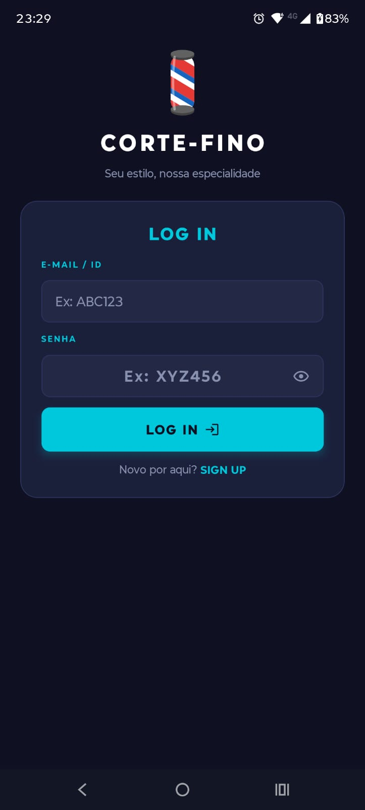
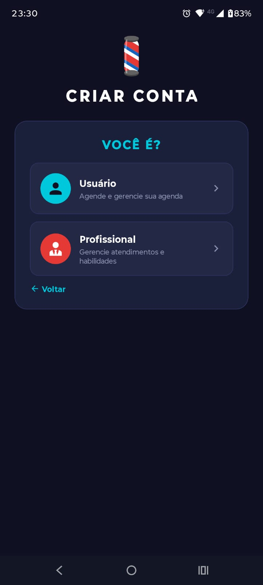
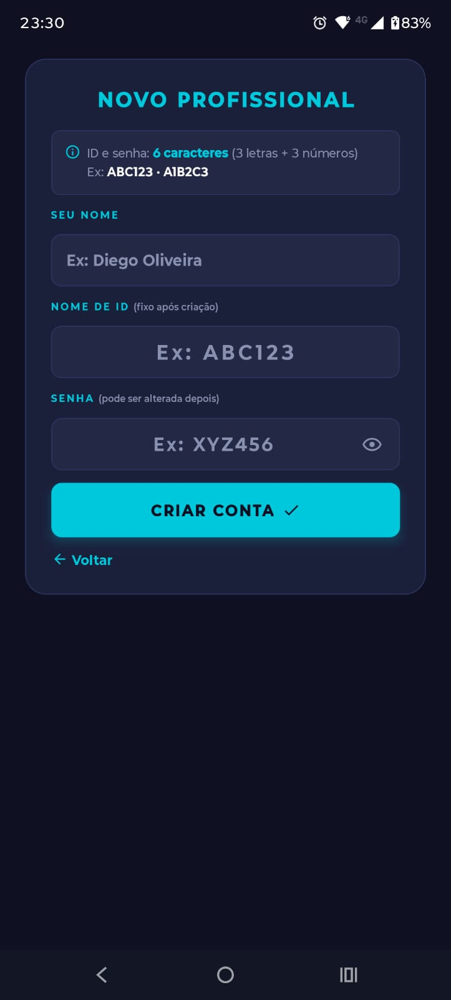
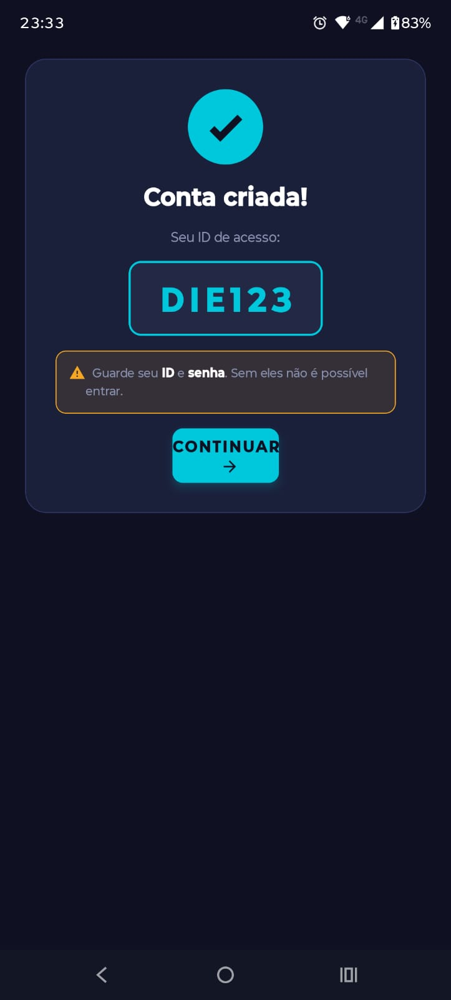
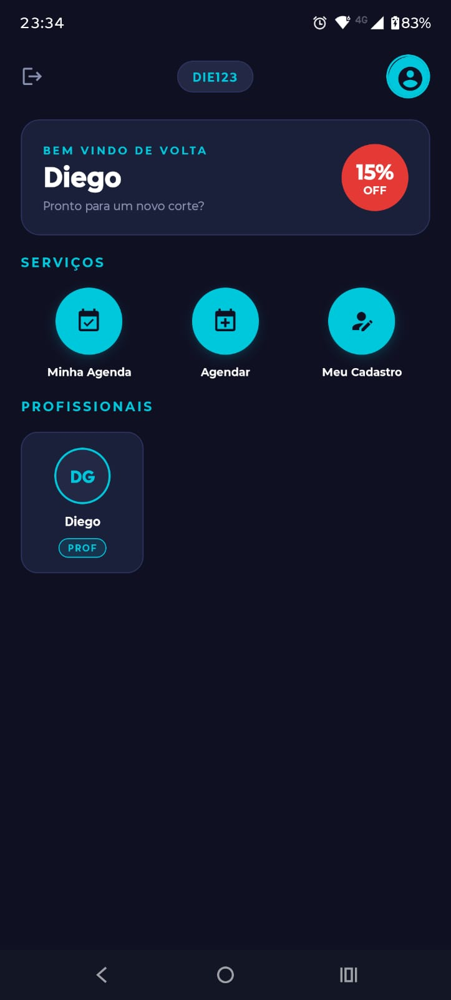
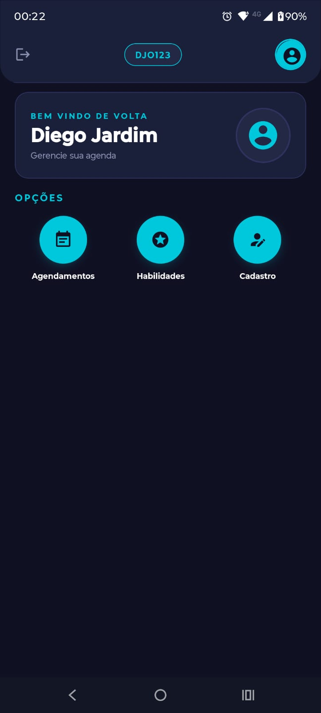
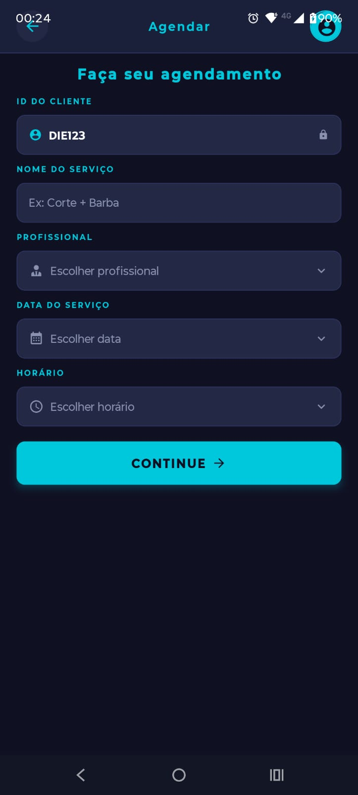
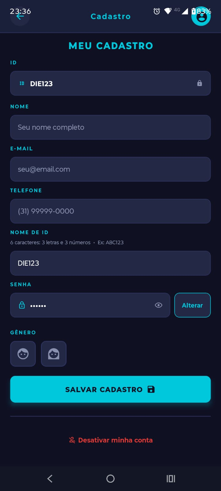
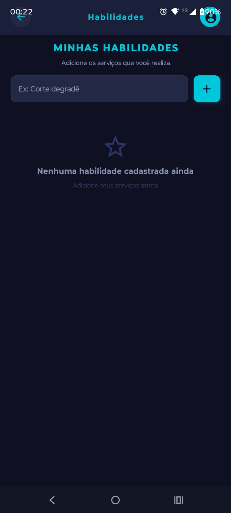
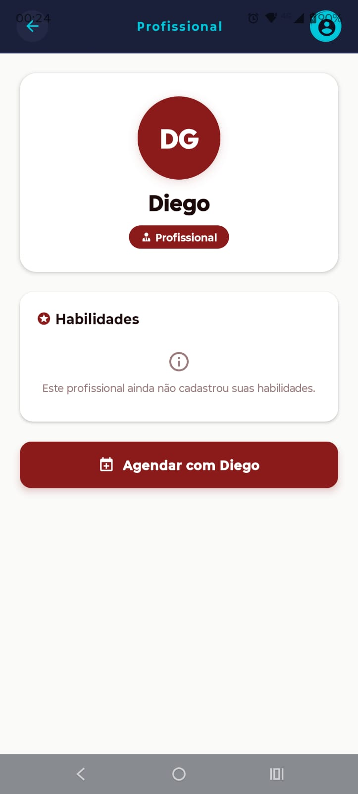

# ✂️ AppBarbearia — CORTE-FINO

> Aplicativo mobile para gerenciamento de agendamentos em barbearias, desenvolvido como trabalho prático semestral da disciplina **Programação para Dispositivos Móveis — 2026.1**.

[](https://reactnative.dev)
[](https://expo.dev)
[](https://expo.github.io/router)
[](https://react-native-async-storage.github.io/async-storage/)

---

## 📋 Índice

- [Descrição do Projeto](#-descrição-do-projeto)
- [Objetivo do Aplicativo](#-objetivo-do-aplicativo)
- [Tipos de Usuário](#-tipos-de-usuário)
- [Funcionalidades](#-funcionalidades)
- [Arquitetura](#-arquitetura)
- [Telas do Aplicativo](#-telas-do-aplicativo)
- [Pré-requisitos](#-pré-requisitos)
- [Instalação e Execução](#-instalação-e-execução)
- [Variáveis de Ambiente](#-variáveis-de-ambiente)
- [Estrutura do Projeto](#-estrutura-do-projeto)
- [Tecnologias](#-tecnologias)

---

## 📖 Descrição do Projeto

O **CORTE-FINO** é um aplicativo mobile desenvolvido em **React Native com Expo** para facilitar o relacionamento entre clientes e profissionais de barbearia. A proposta central é resolver um problema real do domínio: clientes que precisam agendar horários e profissionais que precisam organizar sua agenda de atendimentos — tudo de forma simples, sem dependência de servidores ou internet.

**Domínio escolhido:** Barbearia — agendamento de serviços de estética masculina e feminina, com gestão de profissionais e clientes.

**Persistência:** toda a informação é armazenada localmente no dispositivo via **AsyncStorage**, tornando o app completamente funcional offline.

---

## 🎯 Objetivo do Aplicativo

O aplicativo tem como objetivo principal **digitalizar o processo de agendamento de uma barbearia**, eliminando o uso de cadernos físicos ou mensagens informais. Ele permite que:

- **Clientes** agendem, visualizem e cancelem horários com o profissional de sua escolha, de forma autônoma e a qualquer momento.
- **Profissionais** gerenciem seus agendamentos de forma centralizada, cadastrem os serviços que oferecem e mantenham seu perfil atualizado.

O sistema foi projetado para funcionar como um **MVP (Produto Mínimo Viável)** de barbearia local, sem necessidade de conta em serviço de nuvem ou autenticação externa.

---

## 👥 Tipos de Usuário

O aplicativo opera com dois perfis distintos, cada um com fluxo de navegação e permissões independentes:

| Perfil | Descrição | Tela Inicial |
|--------|-----------|-------------|
| **Usuário (Cliente)** | Pessoa que utiliza os serviços da barbearia. Agenda horários, consulta histórico e gerencia seu perfil. | `Home (index)` |
| **Profissional (Barbeiro)** | Prestador de serviços. Visualiza os agendamentos direcionados a si, gerencia habilidades e mantém seu cadastro. | `HomeProfissionalView` |

Ao criar uma conta, o usuário escolhe explicitamente qual perfil deseja. O roteamento pós-login é automático com base no tipo salvo.

---

## ⚙️ Funcionalidades

### 🔐 Autenticação e Cadastro

- **Login** com ID e senha no formato proprietário: **6 caracteres (3 letras + 3 números)**, ex.: `ABC123`.
- **Cadastro** com seleção de perfil (Usuário ou Profissional), nome completo, ID e senha personalizados.
- **Nome de ID:** campo único definido no primeiro acesso e **bloqueado após salvo** — garante rastreabilidade dos agendamentos.
- **Validação de unicidade** do ID no momento do cadastro.
- **Encerramento de sessão** (logout) disponível na tela inicial.

### 🏠 Tela Inicial — Cliente

- Banner de boas-vindas personalizado com o **primeiro nome** do usuário.
- Promoção em destaque (15% OFF) para engajamento visual.
- Acesso rápido às funcionalidades: **Minha Agenda**, **Agendar** e **Meu Cadastro**.
- Lista de **profissionais ativos cadastrados** no app, com avatar de iniciais e badge de identificação.

### 🏠 Tela Inicial — Profissional

- Painel personalizado com nome, avatar por gênero e lista de habilidades cadastradas.
- Acesso rápido a: **Agendamentos**, **Habilidades** e **Cadastro**.
- Exibição das habilidades como chips visuais.

### 📅 Agendamento

- **Formulário de agendamento** com:
  - Seletor de **profissional** (listado a partir dos cadastrados no app).
  - **Calendário interativo** com navegação por mês.
  - Seletor de **horário** (grades de 08:00 às 20:00 em intervalos de 30 minutos).
  - Campo de **observações** livres.
  - Edição de agendamentos existentes.
- **Lista de agendamentos** com:
  - Filtro automático por perfil: clientes veem apenas seus próprios; profissionais veem apenas os direcionados a eles.
  - Exibição de data, horário, profissional/cliente e status.
  - Confirmação antes de cancelar/excluir.

### 👤 Perfil e Cadastro

- Edição de **nome, e-mail, telefone** e **gênero** (determina o ícone de avatar).
- **Alteração de senha** com campo atual + nova senha + confirmação.
- **Nome de ID:** exibido somente para leitura após bloqueio no primeiro salvamento.
- **Desativação de conta** (soft delete — `ativa: false`): bloqueia login sem apagar dados.

### ⭐ Habilidades (Profissional)

- Gerenciamento de habilidades/serviços prestados (ex.: "Corte degradê", "Barba navalhada").
- Adição e remoção com confirmação.
- Habilidades exibidas na tela inicial do profissional e no detalhe do profissional visto pelo cliente.

### 🔍 Detalhe do Profissional

- Tela acessada pelo cliente ao tocar em um profissional na Home.
- Exibe nome, iniciais e lista de habilidades registradas pelo profissional.
- Botão de atalho para **agendar diretamente** com aquele profissional.

### 📒 Lista de Contatos

- Gerenciamento de contatos pessoais (nome, e-mail, telefone, categoria, favorito).
- Serviço com CRUD completo via `ContatoService`.

---

## 🏗️ Arquitetura

A arquitetura segue o padrão ensinado em aula, com separação clara de responsabilidades:

```
Navegação (Expo Router / Stack)
      ↓
   Views            ← apresentação, estado local, interação do usuário
      ↓
  Services          ← regras de negócio e acesso à persistência
      ↓
  Entities          ← modelagem dos dados (classes com transforme())
      ↓
 AsyncStorage       ← persistência local no dispositivo
 SQLite (initDB)    ← inicializado no _layout; base para evolução futura
```

**Padrão adotado:** Views → Services → Entities, conforme padrão da disciplina (Aulas 10 e 11).

---

## 📱 Telas do Aplicativo

> 💡 **Nota:** Os prints das telas devem ser inseridos no **relatório**. Os espaços abaixo indicam onde cada print deve ser colado.

### Tela 1 — Login




Tela de entrada com logo animado (BarberPole), campos de ID e senha com toggle de visibilidade e link para cadastro.

---

### Tela 2 — Seleção de Tipo de Conta (Sign Up)



Após clicar em "SIGN UP", o usuário escolhe entre os dois perfis disponíveis.

---

### Tela 3 — Cadastro de Usuário / Profissional



Formulário com nome, ID customizado e senha, com regras de formato exibidas em tela.

---

### Tela 4 — Confirmação de Conta Criada



Exibe o ID gerado em destaque com alerta para o usuário guardá-lo.

---

### Tela 5 — Home do Cliente



Banner personalizado, acesso rápido aos serviços e lista de profissionais cadastrados.

---

### Tela 6 — Home do Profissional



Painel com avatar, nome, habilidades cadastradas e acesso às funcionalidades do profissional.

---

### Tela 7 — Formulário de Agendamento



Calendário interativo, seletor de horário em grade e campo de observações.

---

### Tela 8 — Lista de Agendamentos


Cards por agendamento com data, horário, profissional e botão de cancelamento.

---

### Tela 9 — Cadastro / Perfil



Formulário completo com avatar por gênero, alteração de senha e desativação de conta.

---

### Tela 10 — Habilidades (Profissional)



Lista de habilidades cadastradas com chips e campo para adicionar novos serviços.

---

### Tela 11 — Detalhe do Profissional



Habilidades do profissional selecionado e botão de acesso rápido ao agendamento.

---

## ✅ Pré-requisitos

Antes de executar o projeto, instale:

| Ferramenta | Versão mínima | Link |
|------------|--------------|------|
| Node.js | 18.x LTS ou superior | [nodejs.org](https://nodejs.org) |
| npm | 9.x ou superior | (incluso no Node.js) |
| Expo CLI | 6.x | `npm install -g expo` |
| Git | qualquer | [git-scm.com](https://git-scm.com) |
| Android Studio | Hedgehog+ | [developer.android.com](https://developer.android.com/studio) |

> **Emulador recomendado:** Pixel 5 com Android 13 (API 33) ou superior.  
> **Alternativa:** aplicativo **Expo Go** no celular físico (Android ou iOS).

---

## 🚀 Instalação e Execução

### 1. Clone o repositório

```bash
git clone https://github.com/DiegoMorpheus/AppBarbearia.git
cd AppBarbearia
```

### 2. Instale as dependências

```bash
npm install
```

### 3. Execute o projeto

```bash
npx expo start
```

O terminal abrirá o **Metro Bundler** com um QR code e as opções:

| Tecla | Ação |
|-------|------|
| `a` | Abre no emulador Android |
| `i` | Abre no simulador iOS (apenas macOS) |
| `w` | Abre no navegador web |

> ⚠️ **Atenção — Modo Web:** a persistência de agendamentos no navegador usa AsyncStorage com suporte limitado. Para a experiência completa, use o emulador Android.

### 4. Primeiro acesso

Crie uma conta do tipo **Profissional** primeiro, para que apareça disponível na tela do cliente:

1. Na tela de login, toque em **SIGN UP**
2. Selecione **Profissional**
3. Preencha nome, ID (`ABC123`) e senha (`XYZ456`)
4. Em seguida, crie uma conta do tipo **Usuário** para testar o fluxo completo

---

## 🔐 Variáveis de Ambiente

Este aplicativo **não requer variáveis de ambiente**. Toda a persistência é feita localmente no dispositivo via **AsyncStorage** e **SQLite**, sem conexão com servidores externos.

> Caso o projeto evolua para integração com uma API REST, as configurações de ambiente serão incluídas aqui. Exemplo de como ficaria:
>
> ```env
> # .env (exemplo — não necessário na versão atual)
> EXPO_PUBLIC_API_URL=https://api.corte-fino.com.br
> EXPO_PUBLIC_API_TIMEOUT=5000
> ```
>
> Variáveis com prefixo `EXPO_PUBLIC_` ficam acessíveis em tempo de execução via `process.env.EXPO_PUBLIC_*`.

---

## 📁 Estrutura do Projeto

```
AppBarbearia/
├── app/
│   ├── index.jsx                      # Tela inicial do cliente (Home)
│   ├── _layout.tsx                    # Layout raiz: navegação Stack + PaperProvider + initDB
│   │
│   ├── components/
│   │   ├── AvatarIcon.js              # Ícone de avatar baseado em gênero (MaterialCommunityIcons)
│   │   ├── BarberPoleLogo.js          # Logo animado do app (poste de barbearia)
│   │   ├── ClienteItem.js             # Item de lista para contatos
│   │   └── TopDropDownMenu.jsx        # Appbar superior com menu dropdown
│   │
│   ├── entities/
│   │   ├── Agendamento.js             # Entidade de agendamento com normalizeId() e transforme()
│   │   └── ClienteEntity.js           # Entidade de contato/cliente com transforme()
│   │
│   ├── services/
│   │   ├── ClienteService.js          # CRUD de clientes via AsyncStorage
│   │   ├── ContatoService.js          # CRUD de contatos com geração automática de ID
│   │   └── database/
│   │       └── database.js            # Inicialização do SQLite (Android/iOS) com fallback web
│   │
│   └── views/
│       ├── LoginView.js               # Autenticação, cadastro e fluxo de boas-vindas
│       ├── HomeProfissionalView.js    # Tela inicial exclusiva do profissional
│       ├── AgendamentoFormView.js     # Formulário com calendário e seletor de horário
│       ├── AgendamentoListView.js     # Lista filtrada por perfil do usuário logado
│       ├── ContatoFormView.jsx        # Perfil: nome, gênero, senha, desativação de conta
│       ├── ContatoListView.jsx        # Lista de contatos com filtro e ações
│       ├── HabilidadesView.js         # Gerenciamento de serviços do profissional
│       └── ProfissionalDetalheView.js # Detalhe do profissional visto pelo cliente
│
├── assets/                            # Ícones e splash screen do app
├── package.json                       # Dependências e scripts
├── app.json                           # Configurações do Expo (nome, slug, versão)
└── README.md                          # Este arquivo
```

---

## 🛠️ Tecnologias

| Camada | Tecnologia | Versão |
|--------|-----------|--------|
| Framework Mobile | React Native | 0.83 |
| Runtime | React | 19.2 |
| Plataforma | Expo SDK | 55 |
| Navegação | Expo Router (file-based) | v4 |
| Persistência local | AsyncStorage | — |
| Banco de dados local | expo-sqlite (SQLite) | — |
| Ícones | MaterialCommunityIcons (@expo/vector-icons) | — |
| UI Components | react-native-paper | — |
| Linguagem | JavaScript / TypeScript (JSX/TSX) | — |

---

## 👥 Equipe

| Membro | GitHub | Papel |
|--------|--------|-------|
| Diego | [@DiegoMorpheus](https://github.com/DiegoMorpheus) | Desenvolvedor / Responsável pelo repositório |
| Phillip | [@PhillipTI](https://github.com/PhillipTI) | Desenvolvedor |
| Eduarda | [@EduardaSSN](https://github.com/EduardaSSN) | Desenvolvedora |

**Disciplina:** Programação para Dispositivos Móveis — 2026.1  
**Repositório:** [github.com/DiegoMorpheus/AppBarbearia](https://github.com/DiegoMorpheus/AppBarbearia)
